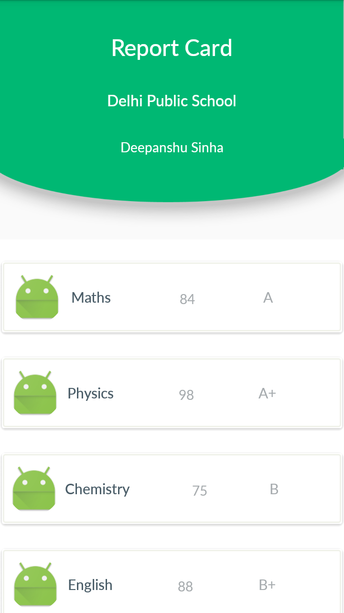
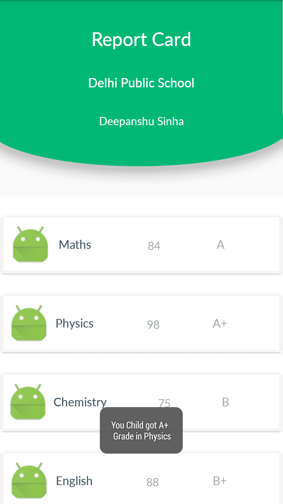

## ReportCardApp
Project which comes under Udacity Android Basics Nanodegree Program

## Project Overview
The goal is to design and create the structure of a ReportCard Java Class which would allow a school to store a student’s grades for a particular year.

## What will I learn?
This project is about combining various ideas and skills we’ve been practicing throughout the course. They include:

1. Designing a custom class
2. Creating that class in Java code.
3. Storing information in an array
4. Looping through an array

## Final Output - Screenshots

Screen 1                          |Screen 2
:--------------------------------:|:--------------------------------:
  |

## Download
You can download the apk here [ReportCardApp](../../raw/master/app/screenshots/app-debug.apk)
